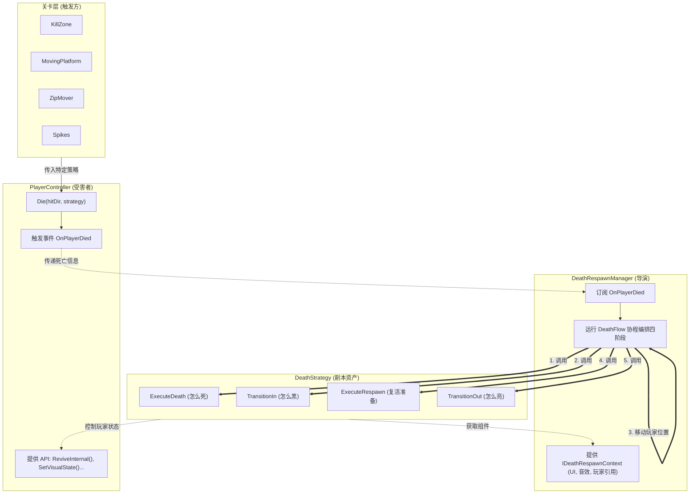

# 💀 DeathStrategy 死亡策略系统

> 本文档从**「从死到生的生命周期」**出发，深度解析死亡策略系统的设计视角、流程编排方式、事件解耦的用法与原因，并梳理架构细节、外部使用方式及各策略实现类的职责与差异。

---

## 📖 一、设计视角：从死到生的生命周期

本节把视角拉高，回答：我们如何设计「从死到生」的整段流程、玩家如何死、流程如何被编排、为何以及如何用事件解耦。

### 1.1 核心设计理念

我们把「死亡 → 复活」视为一段**完整的生命周期**。
当玩家触发死亡时，玩家脚本将**死亡信息**（谁死了、受击方向、使用的**策略剧本**）传递给**死亡重生管理器（DeathRespawnManager）**。管理器拿到信息后，严格按照顺序调用策略中对应的四个阶段，从而**编排**整段流程，最终在存档点完成复活。

**一句话总结：**

* **触发方（关卡）**：决定玩家怎么死，用哪种表现（策略）。
* **编排方（Manager）**：掌控从死到生的节奏与阶段顺序。
* **表现方（Strategy）**：只负责在特定阶段，具体播放什么画面和特效。

### 1.2 玩家是怎么死的？

* **关卡层**（陷阱、移动平台等）：检测到致死条件时，调用 `player.Die(hitDir, strategy)` 或 `player.DieByCrush(strategy)`，并塞入一个配置好的 **DeathStrategy 资产**（或传 null 使用默认策略）。
* **PlayerController**：在 `Die` 方法内，置 `IsDead = true`、关闭碰撞体，然后**立刻广播死亡事件**：`OnPlayerDied(this, hitDir, strategy)`。**玩家不负责自己的复活流程。**

### 1.3 死亡流程是如何编排的？

**DeathRespawnManager** 运行一条雷打不动的 `DeathFlow` 协程，按如下顺序指挥策略资产表演：

1. 🎬 `ExecuteDeath`：玩家怎么死（定格、炸开）。
2. ⬛ `TransitionIn`：屏幕怎么黑（转场收缩）。
3. 📍 **重置位置**：将玩家挪到 Checkpoint，速度清零（由 Manager 执行，非策略）。
4. 👻 `ExecuteRespawn`：复活准备（位置与速度已由 Manager 在上一步重置；策略只做表现准备并**保持隐身**）。
5. 🔆 `TransitionOut`：屏幕怎么亮（转场扩散、聚拢、显形并调用 `ReviveInternal()`）。

### 1.4 为什么要用事件解耦？

如果 Player 或关卡直接调用 Manager 跑流程，代码耦合度将极高。改用**事件（发布-订阅）**后：

* **Player 解耦**：只负责发广播，不管谁来收尸。
* **关卡解耦**：只负责杀人，不管后续怎么演。
* **高扩展性**：如果后续想加「死亡次数统计」或「死亡音效总线」，只需多加一个订阅者，核心逻辑零修改。

---

## 🏗️ 二、架构设计图

下图清晰展示了**谁负责什么**以及**数据流向**。（GitHub 原生支持 Mermaid 渲染；另可参考 [DeathStrategy-Architecture.puml](DeathStrategy-Architecture.puml) 的 PlantUML 版本。）



### 设计模式总结

* **策略模式 (Strategy Pattern)**：抽象死亡的具体表现，让行为可替换。
* **ScriptableObject**：策略作为数据资产存在，策划可在 Inspector 中即插即用、随时调参。

---

## 🎮 三、外部使用与复活机制

### 3.1 触发死亡的常见入口

| 关卡组件 | 调用方式 | 策略来源 |
| --- | --- | --- |
| **KillZone（深坑/即死区）** | `player.Die(down, killStrategy)` | Inspector 拖入（常为 `FallDeathStrategy`） |
| **MovingPlatform** | `player.DieByCrush(crushStrategy)` | 平台组件配置（常为 `CrushDeathStrategy`） |
| **ZipMover（轨道）** | `player.Die(velocity, crushStrategy)` | 轨道组件配置 |
| **Spikes（地刺）** | `player.Die(normal, deathStrategy)` | 尖刺配置（常为 `ExplosionDeathStrategy`） |

### 3.2 💡 核心机制：复活时「不实例化新角色」

为了极致的性能与状态连贯性，**死亡 → 复活全过程始终使用同一个 `PlayerController` 实例，不 `Instantiate` 新对象、不调用 `LoadScene`。**

1. **死亡时**：隐藏视觉表现，关闭碰撞。
2. **黑屏阶段**：Manager 将该玩家的 `transform.position` 瞬间移动到重生点，速度清零。
3. **亮屏复活**：策略在 `TransitionOut` 末尾调用玩家身上的 `ReviveInternal()`。
4. **状态重置（`ReviveInternal`）**：
   * 恢复碰撞体与刚体，清空残留速度。
   * 状态机强制切回 `IdleState`。
   * 体力、冲刺次数回满（根据只读的 `PlayerData` 配置重置）。
   * 动画树重新绑定（`Anim.Rebind()`）。
   * 若有血量、buff，也可在此（或封装的「复活初始状态」）里设回设计值。

---

## 🗂️ 四、内置策略实现类对比

项目中内置了三种基础死亡策略，均可通过 `Create > Game > Death Strategy` 菜单创建资产：

| 维度 | 🌪️ FallDeathStrategy | 🥪 CrushDeathStrategy | 💥 ExplosionDeathStrategy |
| --- | --- | --- | --- |
| **应用场景** | 掉下悬崖、碰到即死区域 | 被移动平台推挤到死角 | 碰到尖刺、敌人 |
| **死亡演出** | 直接原地炸开成小球 | **先压扁变形** → 炸开成小球 | **顿帧 + 屏幕震动** → 炸开 |
| **转场视觉** | 像素网格方向性擦除 (Wipe) | Iris 遮罩圆形收缩/扩张 | Iris 遮罩圆形收缩/扩张 |
| **复活聚拢** | 在 `TransitionOut` 阶段 | 在 `TransitionOut` 阶段 | 在 `TransitionOut` 阶段 |

---

## 🛠️ 五、如何扩展一种新死法？

得益于开闭原则，扩展新死法**不需要修改任何核心代码**：

1. 新建 C# 脚本，继承基类 `DeathStrategy`。
2. 加上 `[CreateAssetMenu]` 标签。
3. 实现四个阶段的协程：
   * 利用传入的 `IDeathRespawnContext ctx` 获取黑屏 UI 遮罩和玩家引用。
   * 使用 `Time.unscaledDeltaTime` / `WaitForSecondsRealtime`，确保在游戏暂停时转场仍能播放完毕。
4. 在编辑器中右键创建该资产，拖给对应的机关陷阱即可生效。

**示例骨架：**

```csharp
[CreateAssetMenu(menuName = "Game/Death Strategy/Toxic Death")]
public class ToxicDeathStrategy : DeathStrategy
{
    public override IEnumerator ExecuteDeath(PlayerController player, Vector3 hitDirection) { /* 播放融化动画 */ }
    public override IEnumerator TransitionIn(IDeathRespawnContext ctx) { /* 屏幕变绿并淡出 */ }
    public override IEnumerator ExecuteRespawn(PlayerController player, Vector2 spawnPos) { /* 保持隐身 */ }
    public override IEnumerator TransitionOut(IDeathRespawnContext ctx) { /* 屏幕亮起，显形并 ReviveInternal */ }
}
```

---

## 📎 六、依赖与约定

* **PlayerController**：提供 `SetVisualState`、`ReviveInternal`、`RB`、`SR`、`GetComponent<PlayerDeathEffect>()` 等，供策略使用。
* **DeathRespawnManager**：实现 `IDeathRespawnContext`，提供 `TransitionImage`、`AudioSource`、`Player` 与重生点；策略通过 `ctx` 访问。
* **PlayerDeathEffect**：`PlayExplode(position, color)`、`PlayReformRoutine(position, color, onComplete)`，由策略在死亡与 `TransitionOut` 中调用。
* **HairController**：部分策略从 `CurrentHairColor` 取炸开颜色，以支持冲刺红、金发等状态。

---

*文档与当前代码状态一致，便于从「策略模式 + ScriptableObject + 死亡流程四阶段」做架构说明与扩展性讨论。*
